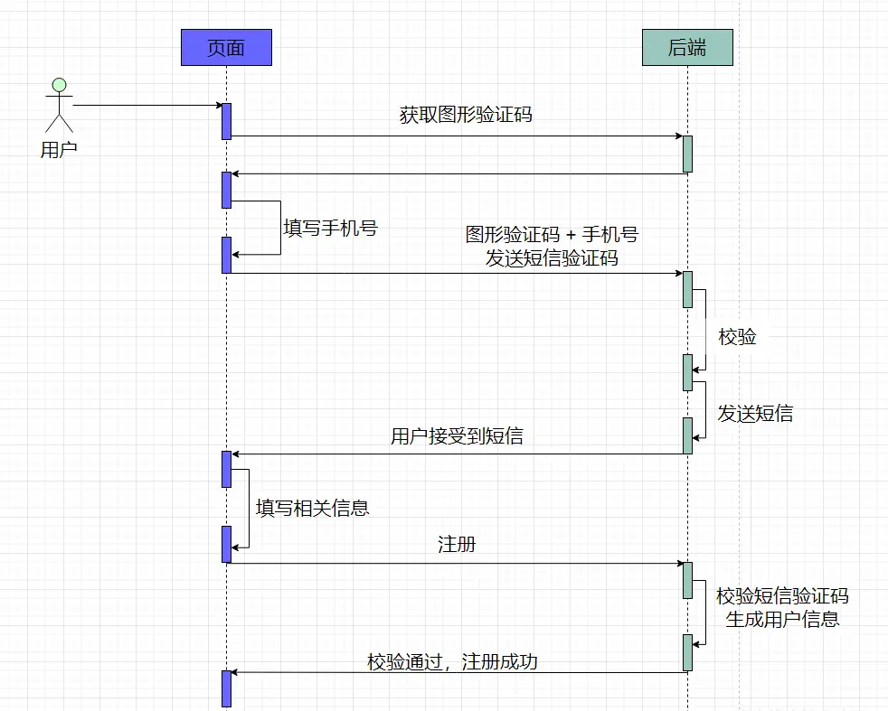

**sign-up-sign-in-by-mobile-number-demo**

**通过手机号实现注册登录**

---

# 核心逻辑

**手机号实现注册与登录认证：**

**Stage1**
后端：生成的图形验证码并缓存，有效期1分钟
前端：请求后端接口获取图形验证码；提交手机号与图形验证码
**Stage2**
后端：校验图形验证码；向目标手机号发送短信验证码，并缓存1分钟
前端：用户收到短信，再次提交手机号和短信验证码
后端：校验短信验证码，注册或登录成功

# 项目启动

1. 导入项目到IDEA
2. 启动Redis
3. 连接数据库，执行初始化SQL脚本：resource/sql.sql
4. 启动项目：访问'http://localhost:8989/signUpSignInByMobileNumber.html'

# 代码阅读

后端代码入口：com/ks/demo/susi/controller/SignUpSignInController.java

前端代码入口：src/main/resources/static/signUpSignInByMobileNumber.html