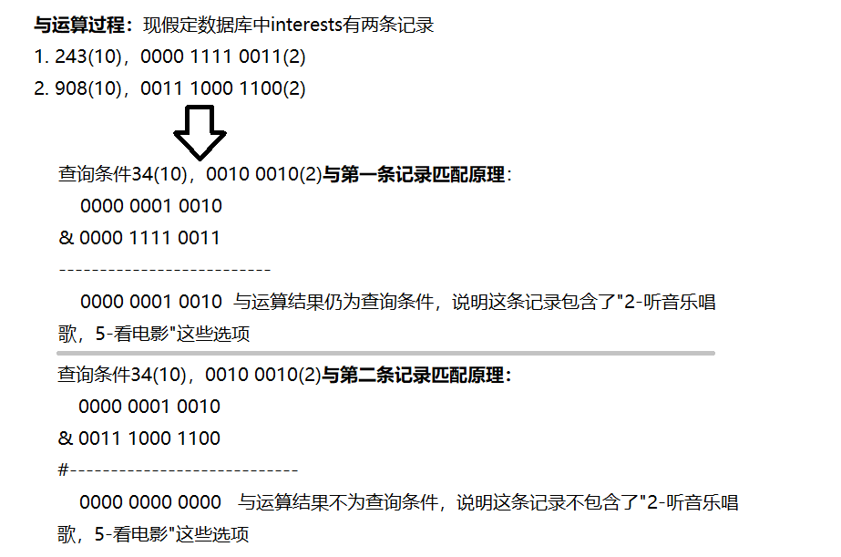

# 背景

**在项目开发中，如何保存多选项的值呢？** 例如下图中的职业发展和兴趣爱好


- 最容易想到的就是，选择了哪些选项，就把该选项值存储起来。

- 在数据库层面设置一个VARCHAR，例如选择了"收入无上线、培训与发展、职业价值感"，前端就传递"收入无上线、培训与发展、职业价值感"，数据库就保存为"收入无上线、培训与发展、职业价值感"。

**可是这样存在一个问题**，我要查询那些人选择了其中的某个、某些选项，就很难实现。例如，查询那些人的兴趣爱好是"编程、篮球"，查询兴趣爱好是"看书、写作"的人数有多少。

**为了解决这种多选项的高效查询问题**，本人设计了一种方法，可以实现**快速、高效地查询**多选项中有某个、某些选项的所有记录。

# 设计思想

**主要思想**

- 将多选项进行**编号**：例如：对职业发展的多选项进行编号为：1-收入无上限，2-培训与发展，3-职业价值感，4-行业稳定性，5-社交与人脉，6-塑造个人品牌，7-团队综合素质，8-终身学习；对兴趣爱好的多选项进行编号为：1-编程，2-听音乐唱歌，3-篮球，4-玩游戏，5-看电影，6-享美食，7-健身，8-旅游，9-看书，10-写作。
- 前端：**选择了哪些选项，就传递哪些选项的编号**。例如：选择了"编程、篮球"，则传递的编号串为："1,3"
- 后端：将**编号串转换为二进制串**，再**转换为数字**，落库
- 查询：前端还是只传选项编号；后端将其转换为数字；在数据库层面使用**位运算中的与运算**，匹配包含了参数选项的记录。

## 将多选项转换为数字

**现以兴趣爱好为例，为其多选项定义编号：** 1-编程，2-听音乐唱歌，3-篮球，4-玩游戏，5-看电影，6-享美食，7-健身，8-旅游，9-看书，10-写作

**根据二进制位下标与十进制数的互转：**


### 例1

- 用户A勾选的兴趣爱好为："1-编程，2-听音乐唱歌，5-看电影，6-享美食"
- 前端传递的串为：1,2,5,6
- 转换为二进制串：0011 0011
- 转换规则：在有选项编号出现的位下标的位置上填充1，其他位置填充0
- 转换为十进制后落库：51


### 例2

- 用户B勾选的兴趣爱好为："3-篮球，4-玩游戏，6-享美食，7-健身，10-写作"
- 前端传递的串为：3,4,6,7,10
- 转换为二进制串：0010 0110 1100
- 转换为十进制后落库：620


## 查询原理

查询的核心思想：与（&）位运算

- X & Y = X，则说明X的所有值为"1"的二进制位、在Y中对应的二进制位也为"1"。
- 也就是说，Y为"1"的二进制位包含了X的所有为"1"的二进制位。从而实现了，查询条件X，在Y中存在（包含）




# 项目启动

Step 1：在application.yml中修改数据库连接参数

Step 2：执行resources/sql.sql下的SQL文件，初始化数据

Step 3：从启动类App.java启动

Step 4：启动成功后进入前端页面：http://localhost:9898/person.html

## 新增数据演示

**必要数据，多选项进行勾选：**


**去数据库查看刚刚新增的记录：**


## 查询数据演示

**选择查询条件，点击“Query”进行查询：**


**查看运行日志，显示执行的SQL：**


# 查询示例

以多选项”兴趣爱好“为例，展示查询的工作原理

## 构造数据

AA选择了"1-编程，2-听音乐唱歌，5-看电影，6-享美食，7-健身，8-旅游"

前端传递的编号串：1,2,5,6,7,8

转换为二进制串：0000 1111 0011

转换为数字：243

BB选择了"3-篮球，4-玩游戏，8-旅游，9-看书，10-写作"

前端传递的编号串：3,4,8,9,10

转换为二进制串：0011 1000 1100

转换为数字：908

CC选择了"2-听音乐唱歌，3-篮球，5-看电影，6-享美食，7-健身，9-看书，10-写作"

前端传递的编号串：2,3,5,6,7,9,10

转换为二进制串：0011 0111 0110

转换为数字：886

DD选择了"1-编程，3-篮球，4-玩游戏，6-享美食，7-健身，8-旅游，10-写作"

前端传递的编号串：1,3,4,6,7,8,10

转换为二进制串：0010 0110 1101

转换为数字：749

EE选择了"2-听音乐唱歌，4-玩游戏，5-看电影，7-健身，8-旅游，10-写作"

前端传递的编号串：2,4,5,7,8,10

转换为二进制串：0010 1101 1010

转换为数字：730

FF选择了"1-编程，2-听音乐唱歌，3-篮球，4-玩游戏，5-看电影，7-健身"

前端传递的编号串：1,2,3,4,5,7

转换为二进制串：0000 0101 1111

转换为数字：95

GG选择了"1-编程，3-篮球，4-玩游戏，6-享美食，8-旅游，10-写作"

前端传递的编号串：1,3,4,6,8,10

转换为二进制串：0010 1010 1101

转换为数字：685

## 插入到数据库

```sql
DROP TABLE IF EXISTS person;
CREATE TABLE person (
    id BIGINT AUTO_INCREMENT,
    name VARCHAR(50) DEFAULT NULL COMMENT '姓名',
    gender INT DEFAULT NULL COMMENT '性别，0-女，1-男',
    address VARCHAR(128) DEFAULT NULL COMMENT '地址',
    careers BIGINT DEFAULT NULL COMMENT '职业发展多选项',
    -- 兴趣爱好多选项。可选项：1-编程，2-听音乐唱歌，3-篮球，4-玩游戏，5-看电影，6-享美食，7-健身，8-旅游，9-看书，10-写作。
    -- 例如，全选："11 1111 1111"，保存为十进制=1023，全不选："00 0000 0000"，保存为十进制=0，只选择听音乐唱歌："0000 0010"，保存为十进制=2
    -- LONG最大支持64位，最多支持64个多选项的任意选择
    interests BIGINT DEFAULT NULL COMMENT '兴趣爱好多选项',
    create_time DATETIME DEFAULT NULL,
    update_time DATETIME DEFAULT NULL,
    deleted INT DEFAULT 0 COMMENT '是否删除：0-否，1-是',
    PRIMARY KEY(id)
);
```

```sql
-- 将上文中构造的数据，以SQL的形式插入到数据库中，只以多选项"兴趣爱好"为例
INSERT INTO person(name, gender, address, careers, interests, create_time, update_time, deleted)
VALUES ('AA', 1, 'SH CN', 1, 243, '2022-12-12','2023-12-12', 0),
       ('BB', 1, 'SH CN', 1, 908, '2022-12-12','2023-12-12', 0),
       ('CC', 1, 'SH CN', 1, 886, '2022-12-12','2023-12-12', 0),
       ('DD', 1, 'SH CN', 1, 749, '2022-12-12','2023-12-12', 0),
       ('EE', 1, 'SH CN', 1, 730, '2022-12-12','2023-12-12', 0),
       ('FF', 1, 'SH CN', 1, 95, '2022-12-12','2023-12-12', 0),
       ('GG', 1, 'SH CN', 1, 685, '2022-12-12','2023-12-12', 0);
```

## 查询选择了"1-编程"这个选项的记录

**目标：** 在多选项中查询选择了"1-编程"这个选项的记录

**用户的"兴趣爱好"多选项（二进制形式）**

> AA： 0000 1111 0011
> BB： 0011 1000 1100
> CC： 0011 0111 0110
> DD： 0010 0110 1101
> EE：  0010 1101 1010
> FF：  0000 0101 1111
> GG： 0010 1010 1101

**将"1-编程"进行转换**

- 转换为二进制：0000 0000 0001

- 转换为十进制：1

**查询原理：** 将查询条件"0000 0000 0001"与AA~GG的二进制位进行与运算后，仍然为查询条件的记录，则是选择了"1-编程"这个选项的记录

**查询过程**

- 将查询条件与AA的二进制位进行与运算：

  > ​     0000 0000 0001
  >
  > &  0000 1111 0011
  >
  > #--------------------------
  >      0000 0000 0001  与运算结果仍为查询条件，说明这条记录包含了"1-编程"这个选项

- 将查询条件与BB的二进制位进行与运算：

  > ​     0000 0000 0001
  > &  0011 1000 1100
  >
  > #----------------------------
  > ​     0000 0000 0000   与运算结果不为查询条件，说明这条记录不包含了"1-编程"这个选项

- 其他记录运算同理
- 最终发现只有AA、DD、FF、GG的运算结果符合条件，这四个记录就是满足"选择了1-编程这个选项的所有记录"

**SQL实现**

```sql
select * FROM person WHERE interests & 1 = 1;
```


## 查询选择了"2-听音乐唱歌，5-看电影"这些选项的记录

**目标：** 在多选项中查询选择了"2-听音乐唱歌，5-看电影"这些选项的记录

**用户的"兴趣爱好"多选项（二进制形式）**

> AA： 0000 1111 0011
> BB： 0011 1000 1100
> CC： 0011 0111 0110
> DD： 0010 0110 1101
> EE：  0010 1101 1010
> FF：  0000 0101 1111
> GG： 0010 1010 1101

**将"2-听音乐唱歌，5-看电影"进行转换**

- 转换为二进制：0000 0001 0010

- 转换为十进制：18

**查询原理：** 将查询条件"0000 0001 0010"与AA~GG的二进制位进行与运算后，仍然为查询条件的记录，则是选择了"2-听音乐唱歌，5-看电影"这个选项的记录

**查询过程**

- 将查询条件与AA的二进制位进行与运算：

  > ​     0000 0001 0010
  >
  >   & 0000 1111 0011
  >   #--------------------------
  >       0000 0001 0010  与运算结果仍为查询条件，说明这条记录包含了"2-听音乐唱歌，5-看电影"这些选项

- 将查询条件与BB的二进制位进行与运算：

  > ​     0000 0001 0010
  >   & 0011 1000 1100
  >   #----------------------------
  > ​     0000 0000 0000   与运算结果不为查询条件，说明这条记录不包含了"2-听音乐唱歌，5-看电影"这些选项

- 其他记录运算同理
- 最终发现只有AA、CC、EE、FF的运算结果符合条件，这四个记录就是满足"选择了2-听音乐唱歌，5-看电影这些选项的所有记录"

**SQL实现**

```sql
select * FROM person WHERE interests & 18 = 18;
```


# 代码设计

后端代码入口：src/main/java/com/ks/demo/mosq/controller/**PersonController.java**

前端代码入口：src/main/resources/static/**person.html**

