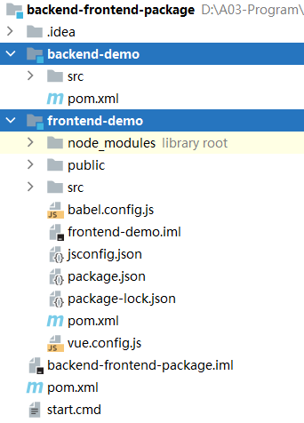
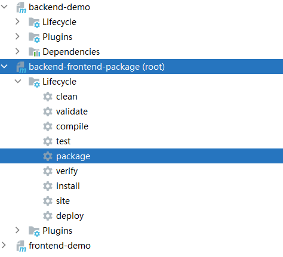
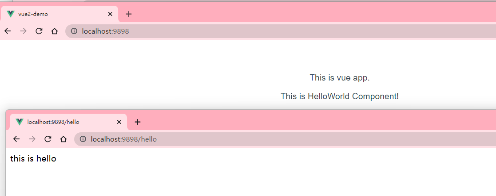

**frontend-maven-package-plugin 前后端统一打包Maven插件**

# 背景

- 在传统的前端分离开发中，前端使用Vue，后端使用SpringBoot

- 在**开发环境**中，两者都需要**分别准备对应的开发环境**。Vue对应的是Node，SpringBoot对应的是JRE（Java Runtime Environment）

- 在**生产环境**中，**Vue代码打包成静态文件，交给Web服务器**（例如Nginx、Tomcat）直接解析；**SpringBoot代码打包为Jar包，运行在JRE**环境中。

- 在生成环境中，有没有一种办法，**将Vue代码打包到Jar包中**，这样就省去了单独部署前端Vue代码的步骤。这就是frontend-maven-plugin解决的问题


# 功能

- 通过frontend-maven-plugin等一系列插件，自动下载配置的Node环境，并指定打包

- **合并打包**前端（Vue）、后端（SpringBoot）分离的项目**到一个Jar包**中，只需要运行该个Jar就可以同时启动前后端项目

- 为什么可以直接打包到Jar？因为前端Vue代码打包后是静态文件，Web服务器是可以直接解析的。而SpringBoot默认内置的Tomcat就是一款Web服务器，那自然就可以正常解析打包到Jar的Vue代码

 

插件官网：https://github.com/eirslett/frontend-maven-plugin




**搭建项目场景**

- backend-demo：后端SpringBoot项目

- frontend-demo：前端Vue基础项目

# 父工程POM

**关键点**

- 指定打包方式为pom

- 聚合子模块

- 管理项目依赖

- 指定编译插件

```xml
<!--指定打包方式：pom，父工程必须加-->
<packaging>pom</packaging>

<modules>
    <module>backend-demo</module>
    <module>frontend-demo</module>
</modules>

<build>
    <plugins>
        <!--编译插件-->
        <plugin>
            <groupId>org.apache.maven.plugins</groupId>
            <artifactId>maven-compiler-plugin</artifactId>
            <version>3.8.0</version>
            <configuration>
                <source>${maven.compiler.source}</source>
                <target>${maven.compiler.target}</target>
                <encoding>${project.build.sourceEncoding}</encoding>
            </configuration>
        </plugin>

        <!--注意：不要再这里放置spring-boot-maven-plugin打包插件。-->
        <!--否则会报错：Unable to find main class。因为这个父工程没有任何代码，更别提主类的。-->
        <!--正确的做法是那个子模块需要打Jar，就放到那个子模块中。-->
   </plugins>
</build>

```

# 后端POM

**关键点**

- 指定打包方式为Jar

- 清除插件maven-clean-plugin，用于在编译前，清除之前编译的文件、文件夹等，避免残留之前的内容

- 前端打包插件frontend-maven-plugin，为项目本地下载/安装Node和NPM，运行npm install命令
  - 安装node环境和npm环境
  - 安装前端项目的依赖：npm install
  - 构建项目：npm run build

- 资源插件maven-resources-plugin，主要为了从前端项目里复制打包好的文件到springboot项目

- 打包插件spring-boot-maven-plugin，将项目达成Jar或War包

```xml

<build>
    <plugins>

        <!-- 清除插件maven-clean-plugin，用于在编译前，清除之前编译的文件、文件夹等，避免残留之前的内容 -->
        <plugin>
            <groupId>org.apache.maven.plugins</groupId>
            <artifactId>maven-clean-plugin</artifactId>
            <version>3.1.0</version>
            <configuration>
                <filesets>
                    <fileset>
                        <!-- 前端资源目录，即：存放前端包目录-->
                        <directory>src/main/resources/public</directory>
                    </fileset>
                    <fileset>
                        <!-- Vue项目打包自动生成的dist目录 -->
                        <directory>${project.parent.basedir}/frontend-demo/dist</directory>
                    </fileset>
                </filesets>
            </configuration>
        </plugin>

        <!--前端打包插件frontend-maven-plugin，为项目本地下载/安装Node和NPM，运行npm install命令-->
        <plugin>
            <groupId>com.github.eirslett</groupId>
            <artifactId>frontend-maven-plugin</artifactId>
            <version>${frontend-maven-plugin.version}</version>
            <configuration>
                <!-- 指定这个plugin的工作目录，相当于进入前端项目的目录：cd frontend-demo -->
                <workingDirectory>${project.parent.basedir}/frontend-demo</workingDirectory>

                <!-- 可选配置，指定node下载地址和版本 -->
                <!-- <nodeDownloadRoot>https://registry.npmmirror.com/-/binary/node/</nodeDownloadRoot> -->
                <nodeVersion>${maven-frontend-plugin.nodeVersion}</nodeVersion>

                <!-- 可选配置，指定npm下载地址和版本 -->
                <!-- <npmDownloadRoot>https://registry.npmmirror.com/-/binary/npm/</npmDownloadRoot> -->
                <npmVersion>${maven-frontend-plugin.npmVersion}</npmVersion>
            </configuration>

            <!--
            主要步骤：
              1.安装node环境和npm环境
              2.安装前端项目的依赖：npm install
              3.构建项目：npm run build
            -->
            <executions>
                <!--安装node环境和npm环境-->
                <execution>
                    <id>install node and npm</id>
                    <goals>
                        <goal>install-node-and-npm</goal>
                    </goals>
                    <configuration>
                        <!--这里可以覆盖上文的configuration标签中指定了nodeVersion-->
                        <nodeVersion>${maven-frontend-plugin.nodeVersion}</nodeVersion>
                    </configuration>
                </execution>

                <!--安装前端项目的依赖：npm install-->
                <execution>
                    <id>npm install</id>
                    <goals>
                        <goal>npm</goal>
                    </goals>
                    <!-- optional: default phase is "generate-resources" -->
                    <phase>generate-resources</phase>
                    <!-- Optional configuration which provides for running any npm command -->
                    <configuration>
                        <arguments>install</arguments>
                        <npmRegistryURL>http://registry.npmmirror.com/</npmRegistryURL>
                    </configuration>
                </execution>

                <!-- 构建项目 -->
                <execution>
                    <id>npm run build</id>
                    <goals>
                        <goal>npm</goal>
                    </goals>
                    <configuration>
                        <arguments>run build</arguments>
                    </configuration>
                </execution>
            </executions>
        </plugin>

        <!--资源插件maven-resources-plugin，主要为了从前端项目里复制打包好的文件到springboot项目-->
        <plugin>
            <groupId>org.apache.maven.plugins</groupId>
            <artifactId>maven-resources-plugin</artifactId>
            <version>3.1.0</version>
            <executions>
                <execution>
                    <id>copy static</id>
                    <phase>generate-resources</phase>
                    <goals>
                        <goal>copy-resources</goal>
                    </goals>
                    <configuration>
                        <!-- 复制前端打包文件到后端项目的public（static亦可） -->
                        <outputDirectory>src/main/resources/public</outputDirectory>
                        <overwrite>true</overwrite>
                        <resources>
                            <resource>
                                <!-- 从前端打包的目录dist进行指定文件、文件夹内容的复制-->
                                <directory>${project.parent.basedir}/frontend-demo/dist</directory>
                                <includes>
                                    <!-- 具体根据实际前端代码、及目录结构进行配置-->
                                    <include>css/</include>
                                    <include>fonts/</include>
                                    <include>img/</include>
                                    <include>js/</include>
                                    <include>favicon.ico</include>
                                    <include>index.html</include>
                                </includes>
                            </resource>
                        </resources>
                    </configuration>
                </execution>
            </executions>
        </plugin>

        <!--打包插件spring-boot-maven-plugin，将项目达成Jar或War包-->
        <plugin>
            <groupId>org.springframework.boot</groupId>
            <artifactId>spring-boot-maven-plugin</artifactId>
            <version>${spring.boot.version}</version>
            <executions>
                <execution>
                    <goals>
                        <!-- repackage可以把依赖的包都打包到生成的Jar包中 -->
                        <goal>repackage</goal>
                    </goals>
                </execution>
            </executions>
        </plugin>
    </plugins>
</build>

```

# 前端POM

**关键点**

- 对应Vue项目而言，pom.xml对它而言是不存在的，也是毫无意义的，此文件可以不要。

- 在此体现出来，只是为了配置子父工程而已，凸显出Vue工程属于父工程的子工程而已，便于IDE导入呈现展示而已。

# 测试

**点击父工程中的“package”**



**在项目根目录建立一个脚本文件：start.cmd**

cd backend-demo/target

java -jar backend-demo-1.0-SNAPSHOT.jar

pause

 

**启动项目后，访问：http://localhost:9898/，http://localhost:9898/hello**

